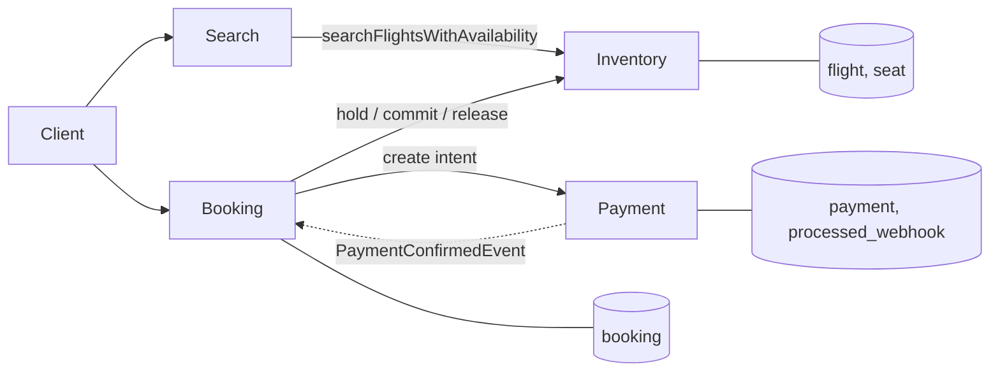
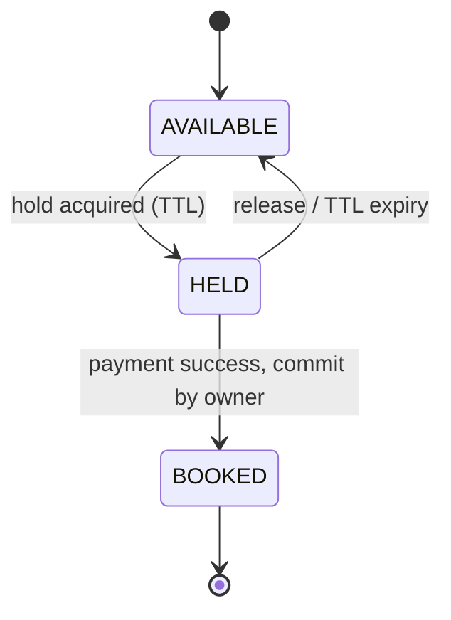
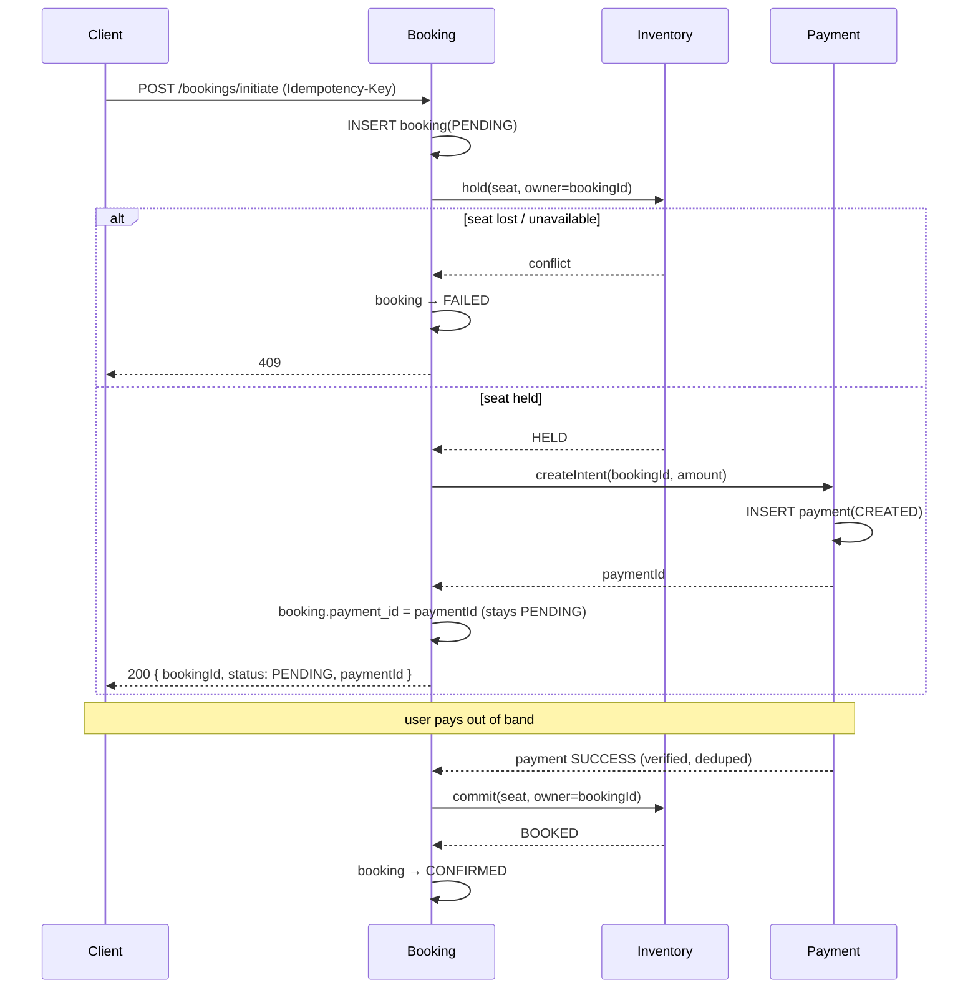

# Flight Booking System — Design Document

## 1. Scope & Architecture Decision

The system supports searching flights and initiating a booking, where initiating a
booking reserves a seat and creates a linked payment intent. Final confirmation is
driven by a payment-success signal from a gateway.

The domain decomposes into four bounded contexts:

- **Search** — read side; owns no tables. Serves flight queries by calling Inventory.
- **Inventory** — owns flight schedules **and** seat state; source of truth for
  availability and the *no-oversell* guarantee.
- **Booking** — orchestrates the booking lifecycle (the saga).
- **Payment** — payment intent, gateway integration, payment state.

**Decision: implement as a modular monolith with these four as internal packages,
not as four deployables.** The boundaries are real and are designed as if they were
services (each owns its tables, they talk through interfaces, the booking saga runs
through an in-process orchestrator). But for a system of this size, four network
hops, a broker, and service discovery would be cost without benefit, and would
weaken — not strengthen — correctness and testability. The seams are kept explicit
so the extraction to microservices is mechanical if scale ever demands it: the
package interfaces become the service contracts, and the in-process event handler
becomes a broker subscription.



---

## 2. Entity Model

### Flight (Inventory) — read by Search
| Field | Notes |
|---|---|
| `scheduled_flight_id` (PK) | one **dated** flight (see Assumptions) |
| `flight_id` | airline flight code, e.g. `6E-203` |
| `source`, `destination` | airport codes |
| `departure_time`, `arrival_time` | |
| `base_fare` | |

### Seat (Inventory) — source of truth for availability
| Field | Notes |
|---|---|
| `seat_id` (PK) | |
| `scheduled_flight_id` (FK → Flight) | |
| `seat_no` | e.g. `12A` |
| `cabin_class` | ECONOMY / BUSINESS |
| `status` | `AVAILABLE` / `HELD` / `BOOKED` |
| `booking_id` | the booking that holds (or has booked) the seat; null when AVAILABLE |
| `hold_expires_at` | TTL for the hold |

**Seats are reference data.** They are inserted once when a flight is provisioned,
all at `AVAILABLE`. The booking flow never *inserts* a seat — it only *transitions*
an existing seat row.

### Booking (Booking)
| Field | Notes |
|---|---|
| `booking_id` (PK) | also written onto the held/booked seat (as its `booking_id`) and used as the payment reference |
| `user_id` | |
| `scheduled_flight_id` | |
| `seat_ids` | the held/booked seats |
| `payment_id` | linked after the intent is created |
| `status` | `PENDING` / `CONFIRMED` / `FAILED` / `EXPIRED` |
| `amount` | |
| `idempotency_key` (UNIQUE) | client-supplied; dedups duplicate initiate requests |
| `created_at`, `updated_at` | |

### Payment (Payment)
| Field | Notes |
|---|---|
| `payment_id` (PK) | |
| `booking_id` (UNIQUE) | at-most-one intent per booking |
| `amount` | |
| `status` | `CREATED` / `SUCCESS` / `FAILED` |
| `idempotency_key` | deterministic from `booking_id` |

### ProcessedWebhook (Payment)
| Field | Notes |
|---|---|
| `event_id` (PK) | gateway-supplied event id; the dedup token for at-least-once webhook redelivery |

### Relationships
```
Flight 1 ──── * Seat
Booking 1 ──── * Seat        (logical; seats referenced by booking_id as hold owner)
Booking 1 ──── 1 Payment
```
Cross-context references (`Booking.scheduled_flight_id`, `Payment.booking_id`) are IDs, not
shared foreign keys — each context owns its own tables.

### Indexes

Indexes are listed by the access path they serve. Those marked *(constraint)* come
free from a PK or UNIQUE constraint and are not added separately.

**Flight**
- `scheduled_flight_id` — PK *(constraint)*.
- `(source, destination, departure_time)` — the search query (§4 / API 1); a single
  composite covers the equality-equality-range filter.

**Seat**
- `seat_id` — PK *(constraint)*; serves the hold/commit conditional update, which
  targets one seat by id.
- `(scheduled_flight_id, status)` — the availability count (JOIN + filter) and
  "list seats for a flight"; composite so the count is served without touching rows.
- `booking_id` — commit/release of every seat held by a booking, and reconciliation
  (`BOOKED` seats vs. non-`CONFIRMED` bookings).
- `(hold_expires_at) WHERE status='HELD'` — partial index for the expiry sweeper;
  only `HELD` rows are ever scanned for expiry, so the index stays small.

**Booking**
- `booking_id` — PK *(constraint)*.
- `idempotency_key` — UNIQUE *(constraint)*; this is the dedup gate for duplicate
  `initiate` calls (§6), so the index is the mechanism, not just an optimization.
- `(status, created_at)` — the `EXPIRED` sweep (find `PENDING` bookings older than
  the hold TTL) and reconciliation scans.

**Payment**
- `payment_id` — PK *(constraint)*.
- `booking_id` — UNIQUE *(constraint)*; enforces at-most-one intent per booking and
  serves the retry lookup that returns the existing intent (§6).
- `processed_webhook(event_id)` — PK *(constraint)*; the webhook-redelivery dedup guard.

---

## 3. State Machines

**Seat:** `AVAILABLE → HELD → BOOKED`, with `HELD → AVAILABLE` on release / TTL expiry.



**Booking:** `PENDING → CONFIRMED | FAILED | EXPIRED`.

**Payment:** `CREATED → SUCCESS | FAILED`.

**Invariant tying them together:** a seat is `BOOKED` **iff** its booking is
`CONFIRMED` **iff** its payment is `SUCCESS`. Every failure path below exists to
preserve this.

---

## 4. Booking Flow (end-to-end)

### How seats are reserved
A hold is acquired with a single atomic, **owner-and-state-guarded** conditional
update — no row lock, no oversell, no distributed lock:

```sql
UPDATE seat
SET status='HELD', booking_id=:booking_id, hold_expires_at=:exp
WHERE seat_id=:sid
  AND ( status='AVAILABLE'
        OR (status='HELD' AND hold_expires_at < now())   -- lazy expiry reclaim
        OR booking_id=:booking_id );                       -- idempotent retry by owner
```

- Row count `1` → won the seat. `0` → lost the race → fail cleanly (409).
- The DB serializes concurrent contenders on the row, so **overselling is
  impossible**; exactly one writer wins.
- Expiry is **lazy**: an expired hold is reclaimable on the next attempt. A
  background sweeper additionally flips stale `HELD → AVAILABLE` for clean reporting,
  but is not required for correctness.

### How booking and payment are created and linked
Booking is the orchestrator and brackets the whole flow (first and last writer).



### What each entity moves through
| Step | Booking | Seat | Payment |
|---|---|---|---|
| initiate | INSERT `PENDING` | — | — |
| hold | — | `AVAILABLE → HELD` | — |
| create intent | link `payment_id` | — | INSERT `CREATED` |
| payment success | — | — | `CREATED → SUCCESS` |
| commit | `→ CONFIRMED` | `HELD → BOOKED` | — |

> `POST /bookings/initiate` performs everything up to **seats held + payment intent
> created**, returning `PENDING`.

### How payment confirmation completes the booking
Confirmation is the second half of the saga, triggered by a **mock gateway webhook**:

```
POST /payments/{paymentId}/confirm   (Event-Id header)
```

1. **Payment** owns this endpoint (it mutates a payment row). It treats the call as
   untrusted webhook input: dedup on `Event-Id` via `processed_webhook` (gateways
   redeliver, at-least-once), a stubbed signature check, then a guarded
   `CREATED → SUCCESS` update.
2. Payment **publishes** `PaymentConfirmedEvent(bookingId)` and touches nothing else —
   not the seat, not the booking. In the monolith this is a Spring `ApplicationEvent`;
   across services it becomes a Kafka topic (see §11).
3. **Booking** listens for the event and orchestrates the finish: `commit(seat,
   owner=bookingId)` (`HELD → BOOKED`), then `booking → CONFIRMED`, in that order.
   If the commit fails (hold expired, seat re-taken), booking is *not* confirmed and
   the refund path applies (§7).

---

## 5. Concurrency & the no-oversell guarantee

The single conditional `UPDATE` in §4 is the entire mechanism. Properties:

- **Correctness without locks:** the DB serializes writers on the seat row;
  the loser observes `rowcount=0`.
- **No distributed lock / Redis required** at this scale.
- **Scaling note (not implemented):** under flash-sale contention on hot seats, a
  Redis `SET seat:{flight}:{seat} {bookingId} NX EX {ttl}` layer can absorb the
  thundering herd off the DB. Critically, **Redis can be the mutex but never the
  source of truth for `BOOKED`** — the durable DB conditional update remains the
  commit-time authority, because an in-memory store loses holds on restart/failover.
  Kept out of the submission deliberately: it adds a second stateful system and a
  distributed-consistency problem to guard a property the DB already guarantees.

---

## 6. Idempotency

Every state change is a single-row conditional update guarded by *owner + current
state*, which makes the system safe under the three retry scenarios:

- **Duplicate client `initiate`:** client supplies `Idempotency-Key`; the
  `UNIQUE(idempotency_key)` constraint on `booking` lets exactly one INSERT win.
  A replay returns the *first call's outcome*, not an error: the existing booking's
  response if it completed, `409`/"in progress" if the original is still mid-flight,
  or the stored failure if it failed (a fresh attempt needs a new key). The key is
  bound to the request payload; same key + different body → 422.
- **Booking → Inventory retried (timeout):** the hold/commit guard
  `... OR booking_id=:booking_id` makes re-applying a no-op success for the owner and a
  correct failure for anyone else. No dedup table needed — natural idempotency via
  state transition.
- **Booking → Payment retried (timeout):** payment key is **deterministic from
  `booking_id`** (never a fresh value per attempt); `UNIQUE(booking_id)` ensures
  at-most-one intent. The same key is passed through to the gateway. Retries
  converge to one payment, so no double charge.
- **Gateway webhook redelivery:** a `processed_webhook(event_id)` guard + the
  payment status precondition make repeated success events no-ops.

---

## 7. Failure Scenarios (addressed explicitly)

| Failure | Handling |
|---|---|
| Lost race for the last seat | Conditional update returns 0 → booking `FAILED`, 409 to client, no hold leaked. |
| Hold succeeds, payment-intent creation fails | Compensate: release hold, booking `FAILED`. |
| User abandons payment | TTL expires the hold (lazy reclaim + sweeper); booking → `EXPIRED`. |
| **Payment SUCCESS but seat commit fails** (hold expired, seat re-taken) | Money is taken but the seat is gone — no clean confirm possible. Resolve by **auto-refund** or **re-accommodate** to another available seat of the same class. TTL is set comfortably above realistic payment time to shrink this window; the refund path always exists. Surfaced via reconciliation, never silently dropped. |
| Duplicate `initiate` (client retry) | Idempotency key returns the original booking; no new hold. |
| Payment internal retry from Booking | Deterministic key + `UNIQUE(booking_id)`; at most one intent. |
| Webhook redelivery | `processed_webhook` + status guard make it idempotent. |
| Crash between *payment SUCCESS written* and *event emitted* | The dual-write problem. Closed by the **outbox pattern**: the payment status row and the outbox event are written in one transaction; a relay publishes from the outbox, so the event cannot be lost independently of the state change. Recovery re-publishes. |
| Crash between *seat BOOKED* and *booking CONFIRMED* | Reconciliation job: a `BOOKED` seat whose booking is not `CONFIRMED` → finish the confirm. (Seat commit precedes booking confirm precisely so this direction is the only residual gap, and it is recoverable.) |
| Inventory/Booking drift | Reconciliation comparing `BOOKED` seats against `CONFIRMED` bookings. |

**Ordering rule:** the seat is committed (`HELD → BOOKED`) **before** the booking is
marked `CONFIRMED`. Confirming first would risk a `CONFIRMED` booking with an
un-booked seat.

---

## 8. API Contracts

### API 1 — Flight Search
```
GET /flights/search?source=BLR&destination=DEL&date=2026-07-15
```
Returns matching flights with availability:
```json
{
  "flights": [
    {
      "flightId": "F21",
      "flightNumber": "6E-203",
      "source": "BLR",
      "destination": "DEL",
      "departureTime": "2026-07-15T08:00:00Z",
      "arrivalTime": "2026-07-15T10:50:00Z",
      "availableSeats": 42,
      "baseFare": 5000
    }
  ]
}
```

### API 2 — Initiate Booking
```
POST /bookings/initiate
Idempotency-Key: <client-generated, stable across retries>

{
  "userId": "U1",
  "flightId": "F21",
  "seatNo": "12A",
  "passengers": [ { "name": "Ayush" } ]
}
```
Success (`200`):
```json
{
  "bookingId": "BK1",
  "status": "PENDING",
  "seatNo": "12A",
  "paymentId": "PAY1",
  "amount": 5000
}
```
Failure modes: `409` seat unavailable, `422` idempotency-key reused with a different
payload, `404` flight/seat not found.

### API 3 — Confirm Payment (mock gateway webhook)
```
POST /payments/{paymentId}/confirm
Event-Id: <gateway event id, stable across redeliveries>
```
Drives `payment → SUCCESS`, `seat → BOOKED`, `booking → CONFIRMED` (§4). Idempotent to
redelivery via `processed_webhook(event_id)`; returns `200` even on a duplicate event
(which is a no-op).

---

## 9. Assumptions & Deliberate Simplifications

1. **A `Flight` row is one dated flight**, not a recurring schedule + dated
   instance. Production would split `FlightSchedule` from `FlightInstance`; collapsed
   here as it does not affect the reservation logic being demonstrated.
2. **Single-seat booking on the hot path** for clarity. Multi-seat extends naturally:
   all seats are held in one transaction; partial holds are released as compensation.
3. **Payment confirmation is implemented as a mock webhook** (`POST
   /payments/{id}/confirm`) standing in for the gateway; signature verification is
   stubbed. It drives payment `SUCCESS` → seat commit → booking `CONFIRMED`.
4. **No auth/users service.** `userId` is taken as given.
5. **Search owns no store**; it calls Inventory for flights + availability (the
   `flight`/`seat` JOIN lives in Inventory). A dedicated read model built from events
   (e.g. Elasticsearch) is described as the scaling step, not built.
6. **Outbox and reconciliation are described** as the crash-safety mechanisms; the
   submission implements the synchronous happy path plus the conditional-update
   guarantees, which are the parts the brief asks to be demonstrated.

---

## 10. Testing Approach (summary)

- **Unit — seat concurrency:** two threads contend for one seat; assert exactly one
  `HELD` and one failure (proves no oversell). This is the most critical logic.
- **Unit — state transitions / guards:** invalid transitions rejected; commit by a
  non-owner fails; idempotent re-initiate returns the same booking.
- **Integration — end-to-end:** search → initiate on a returned result → assert final
  booking state and seat state, per the brief.

---

## 11. Persistence & Communication

**Persistence — JPA for CRUD, native conditional updates for the seat.** Standard
access (flight reads, booking and payment inserts/reads) uses Spring Data JPA. The
seat hold/commit/release are **not** JPA read-modify-write (load entity → set field →
save), because that is a check-then-set race that oversells under concurrency. They are
single atomic conditional `UPDATE`s (`@Modifying @Query(nativeQuery=true)`) returning a
rowcount — the rowcount is the no-oversell signal. No `@Version` or pessimistic locking:
the conditional update already guarantees correctness lock-free. Idempotency rides on
`UNIQUE` constraints (`booking.idempotency_key`, `payment.booking_id`,
`processed_webhook.event_id`) — attempt the insert and catch the violation; never
pre-`SELECT`, which would reintroduce the race.

**Communication — in-process now, the seam for Kafka later.** Packages call each other
through Java service interfaces (booking → inventory, booking → payment; search →
inventory). The one publish/subscribe hop — payment announcing success to booking — is
a Spring `ApplicationEvent` (`PaymentConfirmedEvent`), run **synchronously** so the
payment update, seat commit, and booking confirm share one transaction. This is
deliberately the exact seam that becomes a **Kafka topic** when payment and booking are
extracted into separate services: publisher → topic, `@EventListener` → `@KafkaListener`,
with an **outbox** (§7) making the publish atomic with the state change across the
network boundary.