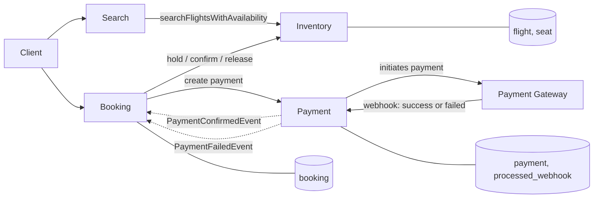
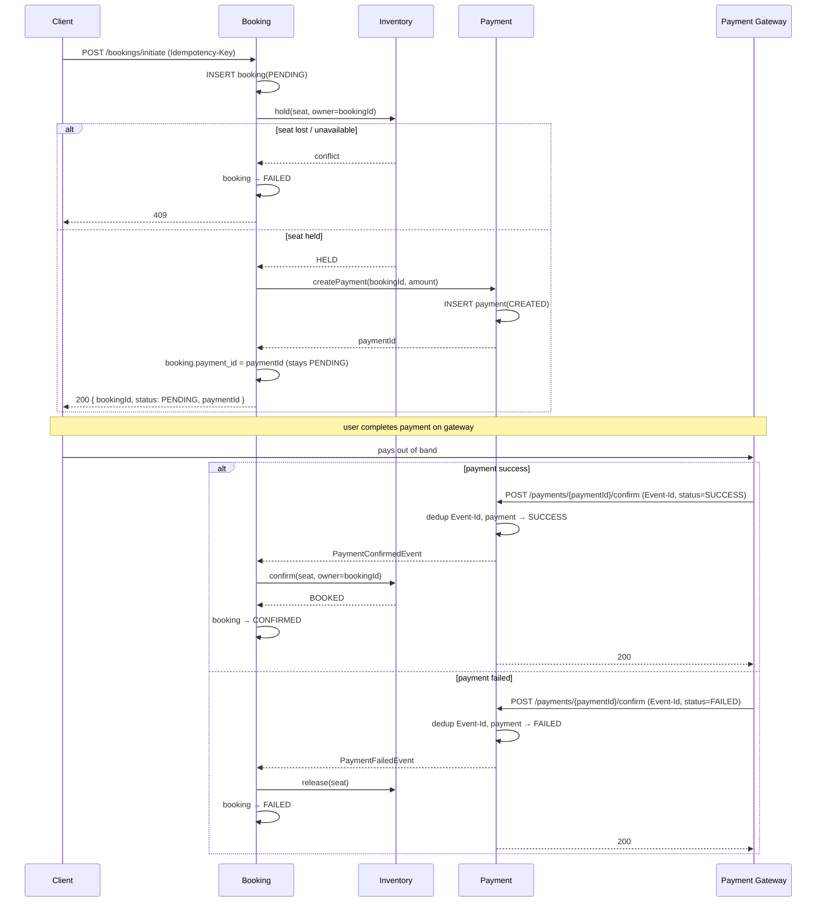

# Flight Booking System — Design Document

## Contents

1. [Scope & Architecture Decision](#1-scope--architecture-decision)
2. [Assumptions & Deliberate Simplifications](#2-assumptions--deliberate-simplifications)
3. [Entity Model](#3-entity-model)
4. [State Machines](#4-state-machines)
5. [Booking Flow](#5-booking-flow-end-to-end)
6. [Idempotency](#6-idempotency)
7. [Failure Scenarios](#7-failure-scenarios)
8. [API Contracts](#8-api-contracts)

---

## 1. Scope & Architecture Decision

The system supports searching flights and initiating a booking, where initiating a
booking reserves a seat and creates a linked payment intent. Final confirmation is
driven by a payment-success signal from a gateway.

The domain decomposes into four bounded contexts:

- **Search** — read side; owns no tables. Serves flight queries by calling Inventory.
- **Inventory** — owns flight schedules **and** seat state; source of truth for
  availability and the *no-oversell* guarantee.
- **Booking** — orchestrates the booking lifecycle (the saga).
- **Payment** — payment intent, gateway integration, payment state.

**Decision: implement as a modular monolith with these four as internal packages,
not as four deployables.** The boundaries are real and are designed as if they were
services (each owns its tables, they talk through interfaces, the booking saga runs
through an in-process orchestrator). But for a system of this size, four network
hops, a broker, and service discovery would be cost without benefit, and would
weaken — not strengthen — correctness and testability. The seams are kept explicit
so the extraction to microservices is mechanical if scale ever demands it: the
package interfaces become the service contracts, and the in-process event handler
becomes a broker subscription.



---

## 2. Assumptions & Deliberate Simplifications
1. **Payment status is communicated via a webhook** (`POST /payments/{id}/confirm`)
   exposed to the payment gateway. The gateway calls it with a `status` field after
   processing the payment out of band.
   - **On `SUCCESS`:** payment → `SUCCESS`, seat → `BOOKED`, booking → `CONFIRMED`.
   - **On `FAILED`:** payment → `FAILED`, held seat released → `AVAILABLE`, booking → `FAILED`.
2. **Payment gateway always responds in under 1 minute.** The seat hold TTL is set to
   10 minutes, providing a comfortable buffer above the expected gateway response time.
   If this assumption is violated and the gateway responds after the hold expires, the
   seat will have been released and the booking will be marked `FAILED` (see §7).
3. **In-process events instead of Kafka.** Kafka has not been used to keep things
   simple. Instead, have used Spring's `ApplicationEventPublisher` / `@EventListener`.
   When the payment service receives a webhook response, it publishes a
   `PaymentConfirmedEvent` or `PaymentFailedEvent` in-process; the booking service's
   `@EventListener` consumes it synchronously in the same transaction.
4. **PostgreSQL for seat locking instead of Redis.** Seat reservation is handled by a
   single atomic conditional UPDATE in PostgreSQL rather than a Redis distributed lock in the current implementation. Have used only postgres and not redis for now.
   A `SET seat:{flight}:{seat} {bookingId} NX EX {ttl}` layer in Redis could absorb
   high traffic and thundering-herd contention off the DB on hot seats, but Redis
   remains only a traffic absorber — the DB conditional UPDATE stays the source of
   truth for `BOOKED`, since an in-memory store loses holds on restart or failover.
5. **Background sweeper for stale holds.** A scheduled job runs every 60 seconds and
   resets any `HELD` seat whose `hold_expires_at` has passed back to `AVAILABLE`. This
   is housekeeping, not a correctness requirement — the `holdSeat` conditional UPDATE
   already reclaims expired holds lazily on the next attempt, and the availability
   COUNT query excludes expired holds from the seat count. The sweeper is needed so
   that stale `HELD` rows do not accumulate in the table over time and so that the DB
   reflects real availability between booking attempts, not just at the moment a new
   request arrives.
6. **No auth/users service.** `userId` is taken as given.
7. **Search owns no store**; it calls Inventory for flights + availability (the
   `flight`/`seat` JOIN lives in Inventory). A dedicated read model could be used for scaling.
8. **Outbox and reconciliation are described** as the crash-safety mechanisms; the
   submission implements the synchronous happy path plus the conditional-update
   guarantees, which are the parts the brief asks to be demonstrated.

---

## 3. Entity Model

### Flight (Inventory) — read by Search
| Field | Notes |
|---|---|
| `scheduled_flight_id` (PK) | one **dated** flight (see Assumptions) |
| `flight_id` | airline flight code, e.g. `6E-203` |
| `source`, `destination` | airport codes |
| `departure_time`, `arrival_time` | |
| `base_fare` | |

### Seat (Inventory) — source of truth for availability
| Field | Notes |
|---|---|
| `seat_id` (PK) | |
| `scheduled_flight_id` (FK → Flight) | |
| `seat_no` | e.g. `12A` |
| `cabin_class` | ECONOMY / BUSINESS |
| `status` | `AVAILABLE` / `HELD` / `BOOKED` |
| `booking_id` | the booking that holds (or has booked) the seat; null when AVAILABLE |
| `hold_expires_at` | TTL for the hold |

**Seats are reference data.** They are inserted once when a flight is provisioned,
all at `AVAILABLE`. The booking flow never *inserts* a seat — it only *transitions*
an existing seat row.

### Booking (Booking)
| Field | Notes |
|---|---|
| `booking_id` (PK) | also written onto the held/booked seat (as its `booking_id`) and used as the payment reference |
| `user_id` | |
| `scheduled_flight_id` | |
| `seat_ids` | the held/booked seats |
| `payment_id` | linked after the intent is created |
| `status` | `PENDING` / `CONFIRMED` / `FAILED` / `EXPIRED` |
| `amount` | |
| `idempotency_key` (UNIQUE) | client-supplied; dedups duplicate initiate requests |
| `created_at`, `updated_at` | |

### Payment (Payment)
| Field | Notes |
|---|---|
| `payment_id` (PK) | |
| `booking_id` (UNIQUE) | at-most-one intent per booking |
| `amount` | |
| `status` | `CREATED` / `SUCCESS` / `FAILED` |
| `idempotency_key` | derived from `booking_id` so retries always produce the same key, preventing the gateway from creating a second charge |

### ProcessedWebhook (Payment)
| Field | Notes |
|---|---|
| `event_id` (PK) | unique ID the gateway attaches to every webhook call; recorded on first delivery so repeated calls for the same event can be detected and ignored |

### Relationships
```
Flight 1 ──── * Seat
Booking 1 ──── * Seat        (logical; seats referenced by booking_id as hold owner)
Booking 1 ──── 1 Payment
```
Cross-context references (`Booking.scheduled_flight_id`, `Payment.booking_id`) are IDs, not
shared foreign keys — each context owns its own tables.

### Indexes

Indexes are listed by the access path they serve. Those marked *(constraint)* come
free from a PK or UNIQUE constraint and are not added separately.

**Flight**
- `scheduled_flight_id` — PK *(constraint)*.
- `(source, destination, departure_time)` — the search query (§5 / API 1); a single
  composite covers the equality-equality-range filter.

**Seat**
- `seat_id` — PK *(constraint)*; serves the hold/confirm conditional update, which
  targets one seat by id.
- `(scheduled_flight_id, status)` — the availability count (JOIN + filter) and
  "list seats for a flight"; composite so the count is served without touching rows.
- `booking_id` — confirm/release of every seat held by a booking, and reconciliation
  (`BOOKED` seats vs. non-`CONFIRMED` bookings).

**Booking**
- `booking_id` — PK *(constraint)*.
- `idempotency_key` — UNIQUE *(constraint)*; this is the dedup gate for duplicate
  `initiate` calls (§6), so the index is the mechanism, not just an optimization.
- `(status, created_at)` — the `EXPIRED` sweep (find `PENDING` bookings older than
  the hold TTL) and reconciliation scans.

**Payment**
- `payment_id` — PK *(constraint)*.
- `booking_id` — UNIQUE *(constraint)*; enforces at-most-one intent per booking and
  serves the retry lookup that returns the existing intent (§6).
- `processed_webhook(event_id)` — PK *(constraint)*; the webhook-redelivery dedup guard.

---

## 4. State Machines

**Seat:** `AVAILABLE → HELD → BOOKED`, with `HELD → AVAILABLE` on release / TTL expiry.


**Booking:** `PENDING → CONFIRMED | FAILED | EXPIRED`.

**Payment:** `CREATED → SUCCESS | FAILED`.

**Invariant tying them together:** a seat is `BOOKED` **iff** its booking is
`CONFIRMED` **iff** its payment is `SUCCESS`. Every failure path below exists to
preserve this.

---

## 5. Booking Flow (end-to-end)

### How seats are reserved
To reserve a seat, a single conditional UPDATE is run directly against the seat row:

```sql
UPDATE seat
SET status='HELD', booking_id=:booking_id, hold_expires_at=:exp
WHERE seat_id=:sid
  AND ( status='AVAILABLE'
        OR (status='HELD' AND hold_expires_at < now())   -- lazy expiry reclaim
        OR booking_id=:booking_id );                       -- idempotent retry by owner
```

- Row count `1` → won the seat. `0` → lost the race → fail cleanly (409).
- Only one concurrent request can win the UPDATE — the rest see `rowcount = 0` and get a 409.
- Expiry is handled in two ways. First, the conditional UPDATE itself includes a check for expired holds — if a seat is `HELD` but its expiry time has passed, the next booking attempt can take it. This means the system stays correct even if nothing else runs. Second, a background job runs every 60 seconds and resets all expired `HELD` seats back to `AVAILABLE` proactively. Without this, a seat that nobody tried to book after its hold expired would stay `HELD` in the database, making it look unavailable to search results even though no one owns it.

### How booking and payment are created and linked
Booking is the orchestrator and brackets the whole flow (first and last writer).



### What each entity moves through
| Step | Seat | Booking | Payment |
|---|---|---|---|
| Before `initiate` | `AVAILABLE`, `booking_id = null`, `hold_expires_at = null` | — | — |
| Hold acquired | `HELD`, `booking_id = BK-1`, `hold_expires_at = now + 10 min` | INSERT `PENDING`, `seat_id` linked | — |
| Hold fails (seat taken or not found) | unchanged `AVAILABLE` | `FAILED` | — |
| Payment intent created | still `HELD` — unchanged | `payment_id` linked, stays `PENDING` | INSERT `CREATED` |
| Payment `SUCCESS` webhook received | `BOOKED`, `hold_expires_at = null` | `CONFIRMED` | `SUCCESS` |
| Payment `FAILED` webhook received | `AVAILABLE`, `booking_id = null` | `FAILED` | `FAILED` | — |

> `POST /bookings/initiate` performs everything up to **seats held + payment intent
> created**, returning `PENDING`.

### How payment confirmation completes the booking
Confirmation is the second half of the saga, triggered by a **mock gateway webhook**:

```
POST /payments/{paymentId}/confirm   (Event-Id header)
```

1. **Payment** owns this endpoint because it is the one changing the payment row.
   The call arrives from the payment gateway, and payment gateways commonly resend
   the same event more than once to make sure it gets through. To handle this safely,
   the service first records the `Event-Id` header in the `processed_webhook` table.
   If a row with that ID already exists, the event was already handled — the service
   returns 200 and does nothing else. If it is a new event, the service checks that
   the request actually came from the gateway (this check is currently stubbed out)
   and then moves the payment status from `CREATED` to `SUCCESS`. The status update
   only applies if the payment is still in `CREATED` state, so a repeated call cannot
   accidentally overwrite a payment that has already been resolved.
2. Payment **publishes** `PaymentConfirmedEvent(bookingId)` and touches nothing else —
   not the seat, not the booking. In the monolith this is a Spring `ApplicationEvent`;
   across services it becomes a Kafka topic (see §11).
3. **Booking** listens for the event and orchestrates the finish: `confirm(seat,
   owner=bookingId)` (`HELD → BOOKED`), then `booking → CONFIRMED`, in that order.
   If the confirm fails (hold expired, seat re-taken), booking is *not* confirmed and
   the refund path applies (§7).

---

## 6. Idempotency

Every state change is a single-row conditional update guarded by *owner + current
state*, which makes the system safe under the three retry scenarios:

- **Duplicate client `initiate`:** client supplies `Idempotency-Key`; the
  `UNIQUE(idempotency_key)` constraint on `booking` lets exactly one INSERT win.
  A replay returns the *first call's outcome*, not an error: the existing booking's
  response if it completed, `409`/"in progress" if the original is still mid-flight,
  or the stored failure if it failed (a fresh attempt needs a new key). The key is
  bound to the request payload; same key + different body → 422.
- **Seat hold retried after a network timeout:** `holdSeat` is idempotent for the
  same owner. If the network drops after the hold is acquired but before the response
  is received, retrying re-runs the same conditional UPDATE. The
  `OR booking_id=:booking_id` branch matches the already-held row and the UPDATE
  succeeds again — returning the same "won the seat" result as the first call. No
  duplicate hold is created, no other booking is displaced, and no dedup table is
  needed. The state transition is the dedup mechanism.
- **Payment intent creation retried after a network timeout:** if `createIntent` is
  called twice for the same booking (e.g. the first response was lost), the second
  INSERT hits the `UNIQUE(booking_id)` constraint. The service catches the violation,
  looks up the existing payment row by `booking_id`, and returns it — so the caller
  gets the same `paymentId` both times. The idempotency key on the payment row is
  derived deterministically from `booking_id` (never randomly generated), ensuring
  the gateway also sees one consistent key across retries and cannot create a second charge.
- **Gateway webhook delivered more than once:** payment gateways guarantee
  at-least-once delivery, so the same webhook can arrive multiple times. On each
  delivery, the service attempts to INSERT the `Event-Id` into `processed_webhook`.
  If the row already exists the INSERT fails and the entire handler exits immediately —
  the payment row is not touched and no event is published — making repeated
  deliveries completely safe.

---

## 7. Failure Scenarios

### During booking initiation

| Scenario | What happens |
|---|---|
| Two clients race for the same seat | The conditional UPDATE is atomic — exactly one caller sees `rowcount=1`. The loser sees `rowcount=0`, their booking is immediately marked `FAILED`, and they receive a 409. No double-hold is possible. |
| Requested seat does not exist on this flight | `NotFoundException` is raised before the booking INSERT. No booking row is created; the client receives a 404. |
| Seat hold succeeds but payment-intent creation throws | The held seat is released back to `AVAILABLE` and the booking is marked `FAILED`. The seat is not leaked. |

### During payment

| Scenario | What happens |
|---|---|
| Customer never completes payment | The hold TTL (10 min) expires. The background sweeper (runs every 60s) detects the stale hold and resets the seat to `AVAILABLE`. If the sweeper hasn't run yet, the seat is still reclaimable on the next booking attempt via the lazy-expiry branch in the conditional UPDATE. The booking remains `PENDING` indefinitely — an EXPIRED sweep to close these out is **not yet implemented**. |
| Gateway sends a `FAILED` webhook | Payment marked `FAILED`. `PaymentFailedEvent` is published; booking service releases the seat and marks the booking `FAILED`. |
| Gateway sends a `SUCCESS` webhook but the hold had already expired | `confirmSeat` UPDATE returns 0 — the seat is no longer `HELD`. The booking is marked `FAILED`. The customer has been charged but has no seat. A refund must be triggered — **refund path is not yet implemented (TODO)**. |
| `SUCCESS` webhook arrives for a booking whose `seatId` is `null` (consequence of `linkSeat` failure) | `bookingService.confirm` loads the booking, sees `PENDING`, and calls `confirmSeat(null, bookingId)`. The SQL `WHERE seat_id = :sid` with `sid = null` matches zero rows (NULL ≠ NULL in SQL), so `confirmSeat` returns false and the booking is marked `FAILED`. The payment is `SUCCESS` — customer charged, no seat, no refund triggered. **Not handled.** |
| Gateway redelivers the same webhook (duplicate `Event-Id`) | The `processed_webhook` INSERT fails on the duplicate PK. The handler exits immediately — payment row is not touched, no event is published, no state changes. Returns 200 to the gateway. |

### Crash safety

| Scenario | What happens |
|---|---|
| Service crashes after payment `SUCCESS` is written but before the event fires | Not possible in the current implementation: the `@EventListener` runs synchronously inside the same `@Transactional` boundary as the payment UPDATE. Either the entire transaction commits (payment SUCCESS + seat BOOKED + booking CONFIRMED) or none of it does. |
| Service crashes after seat is `BOOKED` but before booking is `CONFIRMED` | Booking stays `PENDING` with a `BOOKED` seat. A reconciliation job can detect this state (BOOKED seat + non-CONFIRMED booking) and finish the confirm. The ordering rule — seat committed before booking confirmed — means this is the only residual gap after a crash and it is always recoverable. **Reconciliation not yet implemented.** |

---

## 8. API Contracts

### API 1 — Flight Search
```
GET /flights/search?source=BLR&destination=DEL&date=2026-07-15
```
Returns matching flights with availability:
```json
{
  "flights": [
    {
      "flightId": "F21",
      "flightNumber": "6E-203",
      "source": "BLR",
      "destination": "DEL",
      "departureTime": "2026-07-15T08:00:00Z",
      "arrivalTime": "2026-07-15T10:50:00Z",
      "availableSeats": 42,
      "baseFare": 5000
    }
  ]
}
```

### API 2 — Initiate Booking
```
POST /bookings/initiate
Idempotency-Key: <client-generated, stable across retries>

{
  "userId": "U1",
  "flightId": "F21",
  "seatNo": "12A",
  "passengers": [ { "name": "Ayush" } ]
}
```
Success (`200`):
```json
{
  "bookingId": "BK1",
  "status": "PENDING",
  "seatNo": "12A",
  "paymentId": "PAY1",
  "amount": 5000
}
```
Failure modes: `409` seat unavailable, `422` idempotency-key reused with a different
payload, `404` flight/seat not found.

### API 3 — Confirm Payment (mock gateway webhook)
```
POST /payments/{paymentId}/confirm
Event-Id: <gateway event id, stable across redeliveries>
```
Drives `payment → SUCCESS`, `seat → BOOKED`, `booking → CONFIRMED` (§4). Idempotent to
redelivery via `processed_webhook(event_id)`; returns `200` even on a duplicate event
(which is a no-op).

